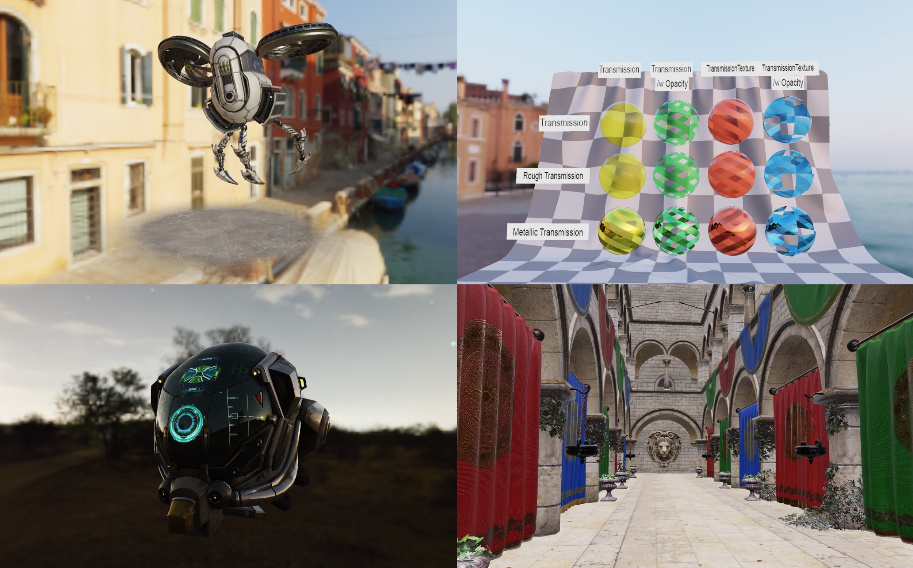

# Renderer

[Live version](https://al-ro.github.io/projects/renderer/)

This project is a real-time WebGL forward renderer. Work is ongoing.

## License

Code: [MIT](https://choosealicense.com/licenses/mit/)
Assets: As specified in each one
